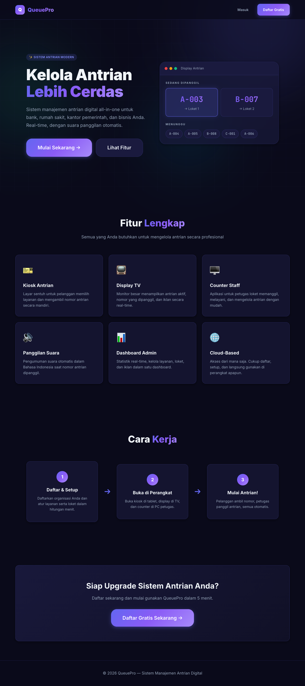
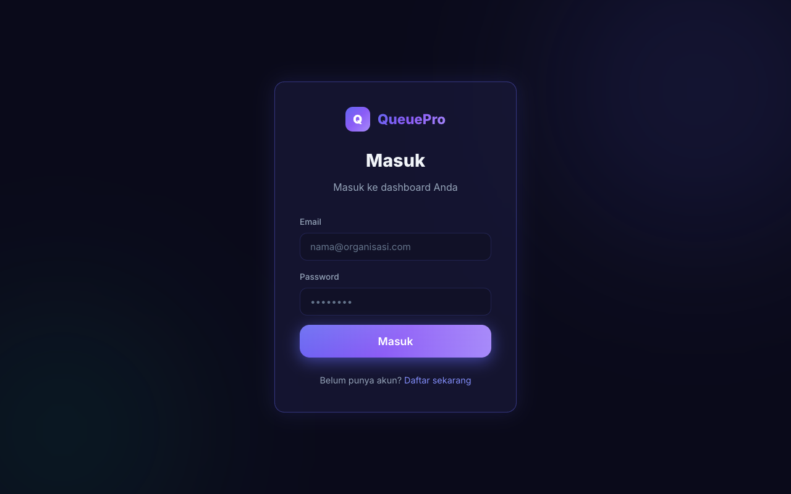

# QueuePro - Sistem Antrian Digital 🚀

QueuePro adalah sistem manajemen antrian modern berbasis web yang dirancang untuk mempermudah pengelolaan antrian di berbagai sektor seperti Bank, Rumah Sakit, Klinik, dan Pelayanan Publik. Sistem ini mendukung arsitektur multi-tenant, pemanggilan suara otomatis (Text-to-Speech), dan pembaruan data secara real-time.

---

## ✨ Fitur Utama

- **Kiosk Pengambilan Tiket (`/kiosk`)**  
  Antarmuka layar sentuh yang ramah bagi pengunjung untuk mengambil nomor antrian berdasarkan layanan yang tersedia.
- **Layar Tampilan Antrian (`/display`)**  
  Monitor real-time yang menampilkan nomor antrian yang sedang dipanggil beserta konter tujuannya. Dilengkapi dengan pemutar video/gambar iklan (Digital Signage) dan notifikasi suara (Text-to-Speech bahasa Indonesia).
- **Dashboard Petugas Konter (`/counter`)**  
  Panel khusus untuk staf melayani antrian, memanggil nomor berikutnya, mengulang panggilan, atau menandai selesai.
- **Admin Panel Terpusat (`/admin`)**  
  Sistem manajemen komprehensif bagi administrator untuk mengatur:
  - Layanan (Poli/Teller/CS)
  - Loket/Konter
  - Iklan & Media Player
  - Pengaturan Organisasi & Profil
- **Teknologi Real-time**  
  Semua perubahan status antrian langsung tersinkronisasi di semua layar web menggunakan WebSockets.

---

## 🖼️ Tangkapan Layar (Screenshots) & Penjelasan Antarmuka

Berikut adalah tampilan antarmuka dari masing-masing fitur dalam sistem QueuePro beserta penjelasannya:

### 1. Halaman Utama (Landing Page)

Halaman awal saat user pertama kali mengakses sistem. Halaman ini memberikan informasi singkat mengenai platform QueuePro. Terdapat tombol untuk menuju ke Dashboard atau sekilas melihat Status Antrian. Jika Anda belum memiliki akun organisasi, Anda bisa membuat atau mendaftar dari halaman awal jika fitur pendaftaran terbuka.

### 2. Halaman Kiosk (Pengambilan Tiket)

Antarmuka untuk pengunjung yang ingin mengambil nomor antrian. Layar ini sangat cocok dipasang di tablet atau layar sentuh. Pengunjung cukup menekan "Ambil Tiket" pada layanan yang dituju, misalnya "Poli Umum", kemudian tiket antrian akan tercetak atau ditampilkan di layar.

### 3. Layar Tampilan Ruang Tunggu (Display TV)

Halaman yang difungsikan untuk ditampilkan pada layar TV (Smart TV/Monitor) di ruang tunggu. Layar ini menampilkan:
- Nomor antrian yang **sedang dipanggil** dengan animasi dan Text-To-Speech (Pemanggilan Otomatis Bahasa Indonesia).
- Daftar tunggu dan informasi terkait Counter (Loket) mana.
- Ruang media (Video/Gambar) untuk kebutuhan digital signage / iklan.

*(Catatan: Browser perlu diizinkan untuk otomatis memutar file suara (autoplay) agar pemanggilan otomatis berjalan.)*

### 4. Admin Dashboard Pusat

Panel yang dapat diakses oleh Administrator Sistem (misalnya manajer klinik/bank) setelah berhasil login. Di sini Anda bisa:
- Menambah/mengedit Loket (Counter).
- Menambah/mengedit Layanan apa saja yang ada.
- Menyesuaikan pengaturan video iklan untuk Layar Tampilan.

### 5. Halaman Petugas Konter / Loket

Halaman yang digunakan oleh masing-masing Staf Petugas (misal: Teller 1, Poli Gigi, dsb) di komputernya.
- **Panggil Berikutnya:** Untuk memanggil pengunjung di nomor selanjutnya secara otomatis.
- **Panggil Ulang:** Untuk mengulangi panggilan via suara di TV.
- **Selesai:** Menandai pengunjung telah selesai dilayani.

---

## 🛠️ Teknologi yang Digunakan

**Frontend (Client):**
- React 19 + Vite
- React Router DOM
- Socket.IO Client
- Vanilla CSS (Desain modern dan responsif)

**Backend (Server):**
- Node.js & Express.js
- Socket.IO (WebSockets)
- Prisma ORM
- SQLite (Pengembangan Lokal) / PostgreSQL/MySQL (Bisa disesuaikan untuk Produksi)
- JWT (JSON Web Tokens) untuk Otentikasi
- Multer (Manajemen Upload Media)

---

## ⚙️ Persyaratan Sistem (Prerequisites)

Sebelum menjalankan aplikasi ini, pastikan sistem Anda telah terinstal:
- [Node.js](https://nodejs.org/en/) (Versi 18 atau terbaru)
- [npm](https://www.npmjs.com/) (Biasanya sudah termasuk di Node.js)
- [Git](https://git-scm.com/)

---

## 🚀 Panduan Instalasi & Menjalankan Aplikasi Lokal

Ikuti langkah-langkah berikut untuk menjalankan QueuePro di komputer Anda (Localhost).

### 1. Kloning Repositori
```bash
git clone https://github.com/duwiarsana/SoftwareAntrianBankRS.git
cd SoftwareAntrianBankRS
```

### 2. Setup Mode Server (Backend)
Buka terminal baru, navigasikan ke folder `server`:
```bash
cd server
npm install
```

**Konfigurasi Environment Backend:**
Buat salinan file `.env`:
```bash
cp .env.example .env
```
Pastikan isi dari `.env` di folder `server` sesuai (khususnya untuk `DATABASE_URL`, `JWT_SECRET`, dll).

**Inisialisasi Database:**
```bash
# Sinkronisasi skema Prisma ke Database
npx prisma db push

# (Opsional) Jalankan seed jika ada untuk membuat akun admin default
npm run db:seed 
```

**Jalankan Server:**
```bash
npm run dev
```
*Server akan berjalan secara default di `http://localhost:3001`.*

### 3. Setup Mode Client (Frontend)
Buka terminal baru lainnya, navigasikan ke folder `client`:
```bash
cd client
npm install
```

**Jalankan Frontend:**
```bash
npm run dev
```
*Aplikasi frontend dapat diakses di `http://localhost:5173`.*

---

## 🐳 Menjalankan Menggunakan Docker (Produksi/Deployment)

Aplikasi ini juga menyediakan konfigurasi `Dockerfile` dan `docker-compose.yml` agar lebih mudah di-deploy di VPS (Virtual Private Server).

1. Pastikan Anda memiliki Docker dan Docker Compose.
2. Di root direktori proyek, jalankan:
   ```bash
   docker-compose up -d --build
   ```
3. Docker akan mem-build frontend dan backend, serta menjalankan kontainer untuk Anda.

---

## 📂 Struktur Folder Proyek

```text
SoftwareAntrianBankRS/
│
├── client/                 # Root Frontend (React + Vite)
│   ├── public/             # File statis (favicon, logo)
│   ├── src/
│   │   ├── assets/         # Gambar, ikon, stylesheet dasar
│   │   ├── contexts/       # React Context (Auth State)
│   │   ├── lib/            # Fungsi utilitas (API Axios, Socket, Voice TTS)
│   │   ├── pages/          # Komponen Halaman (Admin, Kiosk, Display, Counter)
│   │   ├── App.jsx         # Routing Utama (React Router)
│   │   └── main.jsx        # Entry point React
│   └── package.json        
│
├── server/                 # Root Backend (Node.js + Express)
│   ├── prisma/             # Skema ORM Database (schema.prisma) dan File SQLite
│   ├── src/
│   │   ├── middleware/     # Middleware Otentikasi & Upload
│   │   ├── routes/         # Endpoint REST API (Auth, Tickets, dll)
│   │   ├── socket/         # Event handler WebSockets (Socket.IO)
│   │   └── index.js        # Entry point Server Node.js
│   └── package.json
│
├── docker-compose.yml      # Konfigurasi Docker (Orchestration)
├── Dockerfile              # Docker Image Buid Script
└── README.md               # Dokumentasi Proyek
```

---

## 📝 Akun Default (Setelah Setup)

Jika proses *Seeding Database* berhasil dilakukan, sistem telah disiapkan dengan akun admin bawaan agar Anda bisa langsung mengujinya. 
(Ganti kredensial ini segera setelah berhasil login jika Anda deploy ke publik).

- **URL Dashboard/Admin:** `http://localhost:5173/login`
- **Email:** *Silahkan registrasi organisasi baru melalui halaman utama atau ikuti kustomisasi seeding di Prisma.*
  *(Catatan: Anda dapat membuat Organisasi baru dan akun pengguna pertama melalui alur Pendaftaran/Register yang ada di aplikasi)*

---

## 🤝 Kontribusi

Kami sangat menghargai kontribusi dari siapa pun! Untuk berkontribusi:
1. Lakukan *Fork* repositori ini.
2. Buat *branch* fitur Anda (`git checkout -b fitur-saya`).
3. Lakukan *commit* terhadap perubahan Anda (`git commit -m 'Menambahkan fitur keren'`).
4. Lakukan *Push* ke branch Anda (`git push origin fitur-saya`).
5. Buka sebuah *Pull Request* (PR).

---

## 📄 Lisensi

Sebagian besar proyek perangkat lunak ini terbuka untuk penggunaan pembelajaran dan pengembangannya disesuaikan dengan kebutuhan pemesan asli. Mohon taati aturan lisensi standard apabila hendak dikomersialkan ulang.

Dibuat dengan ❤️ untuk sistem pelayanan yang lebih baik.
